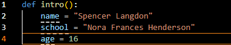

 
 
🦾 My skills include: 🦾 
- Coding basic Python scripts.
- Slightly modifying webpages with JavaScript code.
- Creating basic webpages in HTML.

🧠 Some things I would like to improve on are: 🧠
- Creating actual websites in HTML.
- Coding more advanced Python scripts.
- Modifying webpages in Javascript.
- Learning the basics of C# code.

📁 You can find projects that I've made in my repositories. 📁
